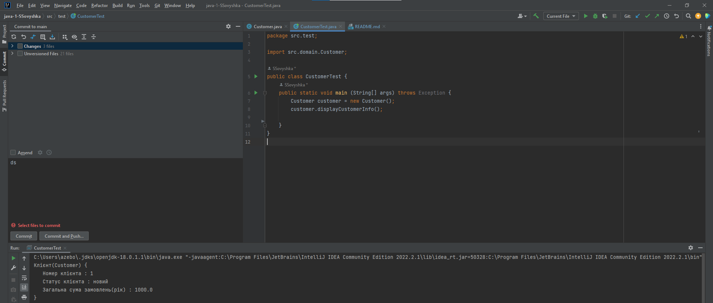
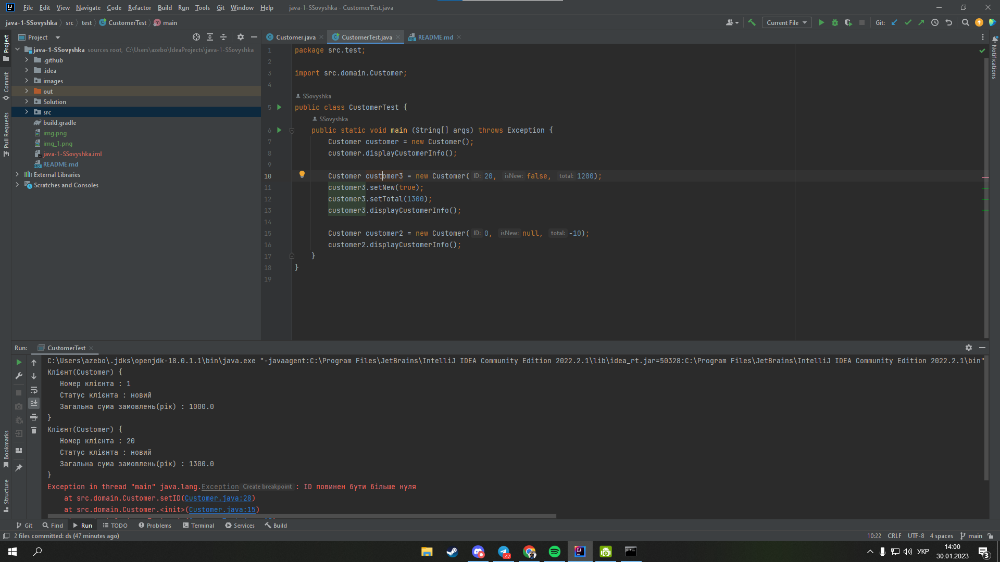

[](https://classroom.github.com/open-in-codespaces?assignment_repo_id=9864364)
# Створення класів

Це друга лабораторна робота в нашому курсі з ООП, в ході якої ви маєте отримати навички зі створення класів та тестування їх працездатності. Робота дуже маленька та складається з двох завдань.

## Завдання 1. Створення класу з атрибутами

1. **клонуйте** створений для вас репозиторій в Netbeans (детальна інструкція з картинками є [тут](https://netbeans.org/kb/docs/ide/git.html)), **відкрийте** в [Repl.It](https://repl.it/) ([ось](https://repl.it/talk/learn/Configuring-GitHub-repos-to-run-on-Replit-and-contributing-back/23948) покрокова інструкція з картинками) або **просто завантажте** його вміст у ZIP-форматі (скориставшись кнопкою "Code" > "Download ZIP") і відкрийте в IDE за вашим вибором
2. створіть **в пакеті ````domain````** клас ```` Сustomer ```` з такими **приватними атрибутами**:
    * ````ID```` (номер клієнта, **ціле** число)
    * ````isNew```` (статус клієнта новий він чи старий, **булевське** значення)
    * ````total```` (сума замовлень за рік, **дробове** число)
3. атрибути повинні мати **значення за замовчуванням** (наприклад, ````1```` для ````ID````, ````true```` для ````isNew````, ````1000```` для ````total````, див. відеозапис лекції).

**УВАГА! Repl.It на даний момент не підтримує пакети, тож краще виконувати роботу в Netbeans!** Якщо виконуєте в Repl.It - робите як минулого разу - все в дефолтному пакеті (й не забувайте про файли ````.replit```` і ````start.sh````!).

## Завдання 2. Додавання в клас методів 

Додати до класу метод ````displayCustomerInfo````, який виводить на консоль інформацію про клієнта з допомогою ````System.out.println````. Кожен рядок має містити відповідну мітку, наприклад, "Total purchases are:" (див. перердню роботу).


## Перевірка працездатності створеного класу

1. Створив пакет test і зробив клас CustomerTest, в методі main створив об'єкт класу Сustomer та вивів на екран.
2. Програмний код і результат запуска коду.
``` java
package src.test;

import src.domain.Customer;

public class CustomerTest {
public static void main (String[] args) throws Exception {
    Customer customer = new Customer();
    customer.displayCustomerInfo();
    }
}
```
    



## Виконання завдання на 5 балів

**Програмний код і результат запуска коду.**


  ``` java 
package src.domain;

public class Customer {
    private int ID;
    private Boolean isNew;
    private double total;

    public Customer() {
        this.ID = 1;
        this.isNew = true;
        this.total = 1000.0;
    }

    public Customer(int ID, Boolean isNew, double total) throws Exception {
        setID(ID);
        setNew(isNew);
        setTotal(total);
    }

    public int getID() {
        return ID;
    }

    public void setID(int ID) throws Exception {
        if(ID > 0){
            this.ID = ID;
        }else{
            throw new Exception("ID повинен бути більше нуля");
        }
    }

    public boolean isNew() {
        return isNew;
    }

    public void setNew(Boolean aNew) {
        if (aNew != null){
            isNew = aNew;
        }else{
            isNew = true;
        }
    }

    public double getTotal() {
        return total;
    }

    public void setTotal(double total) throws Exception{

        if(total < 0){
            throw new Exception("Сума повинна бути більше нуля");
        }else{
            this.total = total;
        }
    }

    public void displayCustomerInfo(){
        System.out.println("Клієнт(Customer) {" + "\n" +
                "   Номер клієнта : " + ID + "\n" +
                "   Статус клієнта : " + (isNew ? "новий" : "старий") + "\n" +
                "   Загальна сума замовлень(рік) : " + total + "\n" +
                "}");
    }

}  
  ```


